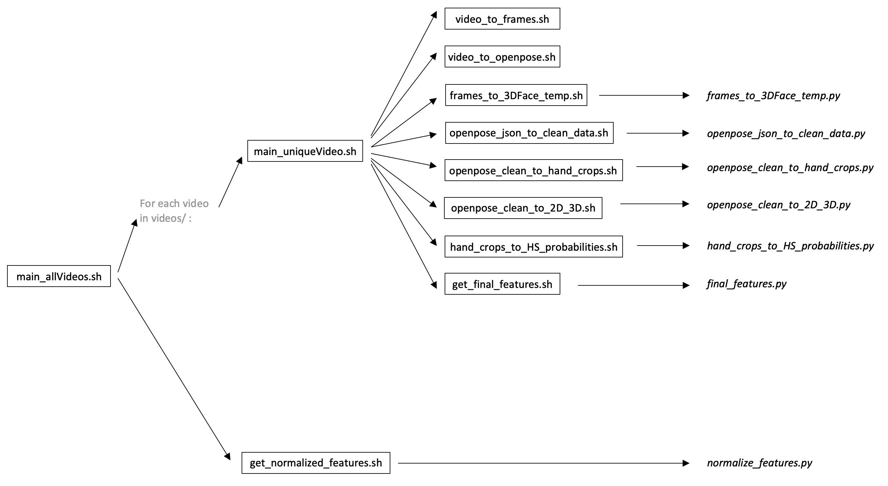

# Feature extractor for cslr_limsi



- All scripts have to be run from the main folder (`cslr_limsi_features`).
- The whole pipeline uses three Anaconda virtual Python environment (see below). Their names are stored in `scripts/virtual_env_names/`.aa

### Usage

Open your shell, go to the `cslr_limsi_features` folder, and execute `./main_allVideos.sh'.

## Requirements

- Openpose, tested with CUDA8.0
- Three virtual Python environments. You can use the three `.yml`files at the root of the repo to reproduce them:
  - `cslr_limsi_features_env1`:
    - python 3.7
    - numpy
    - scipy (1.1.0)
    - pillow
    - pytorch (0.4.1)
    - dlib (installed via pip)
    - scikit-image
    - opencv-python
    - scikit-learn
  - `cslr_limsi_features_env2`:
    - python 3.6
    - tensorflow-gpu 1.2.1
    - keras 2.1.5
    - pillow
    - scipy (1.1.0)
  - `cslr_limsi_features_env3` (used with Caffe):
    - python 2.7
    - pillow
    - numpy
    - scipy 1.1.0
- Caffe, tested with Python 2.7. It should be possible to install Caffe with Python 3, and thus use only `cslr_limsi_features_env1` and `cslr_limsi_features_env2`. It might be necessary to add Caffe to PATH before running the scripts, for instance by executing this in shell:
```
export CAFFE_ROOT=/people/belissen/caffe/
export PYTHONPATH=/people/belissen/caffe/distribute/python:$PYTHONPATH
export PYTHONPATH=/people/belissen/caffe/python:$PYTHONPATH
```
- Setting the absolute paths correctly in `script/paths/...`
- Put your video files in `videos` (or change `script/paths/path_to_videos.txt` to where your videos are stored


## Main scripts
### **`main_allVideos.sh`**
  - Runs all scripts in `scripts/` for all videos inside `videos/`, then normalizes final features with respect to the average and standard deviation of features computed for all videos
  - Calls:
    - `main_uniqueVideo.sh` for each video
    - `get_normalized_features.sh`
  - Parameters:
    - `--fps`: Framerate per second (all videos are supposed to be recorded at the same framerate)
    - `--framesExt`: Frame files extension for ffmpeg
    - `-n`, `--nDigits`: Number of digits for frame numbering (if n=5, frames are number 00000.jpg, 00001.jpg, etc.)
    - `--body3D`: 3D Body computed
    - `--face3D`: 3D Face computed
    - `--hs`: Hand shapes probabilities (Koller cafe model)
    - `--keep_full_frames`: if you want not to delete full frames after all features are computed
    - `--keep_hand_crop_frames`: if you want not to delete hand crop frames after all features are computed
    - `--keep_openpose_json`: if you want not to delete openpose json files after all features are computed
    - `--keep_temporary_features`: if you want not to delete temporary features all final features are computed
  - Outputs:
    - See detail of other scripts
  - Example: `./main_allVideos.sh --fps 25--framesExt jpg -n 5 --body3D --face3D --hs --keep_full_frames --keep_hand_crop_frames --keep_openpose_json --keep_temporary_features`

### **`main_uniqueVideo.sh`**
  - Runs all scripts in `scripts/` for one video inside `videos/`
  - Calls:
    - `scripts/video_to_frames.sh`
    - `scripts/video_to_openpose.sh`
    - `scripts/frames_to_3DFace_temp.sh` (if `--face3D`, see parameters)
    - `scripts/openpose_json_to_clean_data.sh`
    - `scripts/openpose_clean_to_hand_crops.sh` (if `--hs`, see parameters)
    - `scripts/openpose_clean_to_2D_3D.sh`
    - `scripts/hand_crops_to_HS_probabilities.sh` (if `--hs`, see parameters)
    - `scripts/get_final_features.sh` (for 2D features, as well as for 3D ones if `--body3D` and `--face3D`)
  - Parameters:
    - `-v`, `--vidName`: Video name without extension
    - `--vidExt`: Video file extension
    - `--fps`: Framerate per second
    - `--framesExt`: Frame files extension for ffmpeg
    - `-n`, `--nDigits`: Number of digits for frame numbering (if n=5, frames are number 00000.jpg, 00001.jpg, etc.)
    - `--body3D`: 3D Body computed
    - `--face3D`: 3D Face computed
    - `--hs`: Hand shapes probabilities (Koller cafe model)
    - `--keep_full_frames`: if you want not to delete full frames after all features are computed
    - `--keep_hand_crop_frames`: if you want not to delete hand crop frames after all features are computed
    - `--keep_openpose_json`: if you want not to delete openpose json files after all features are computed
    - `--keep_temporary_features`: if you want not to delete temporary features all final features are computed
  - Outputs:
    - See detail of other scripts
  - Example: `./main_uniqueVideo.sh -v test_video_1 --vidExt mp4 --fps 25 --framesExt jpg -n 5 --handOP --faceOP --body3D --face3D --hs --keep_full_frames --keep_hand_crop_frames --keep_openpose_json --keep_temporary_features`

## Included scripts
### **`scripts/video_to_frames.sh`**
  - Converts any video to frames, in a separate folder inside `frames/full/`
  - Parameters:
    - `-v`, `--vidName`: Video name without extension
    - `--vidExt`: Video file extension
    - `--framesExt`: Frame files extension for ffmpeg
    - `-n`, `--nDigits`: Number of digits for frame numbering (if n=5, frames are number 00000.jpg, 00001.jpg, etc.)
  - Outputs:
    - `frames/full/vidName/00001.jpg`
    - ...
    - `frames/full/vidName/07342.jpg` (if the video contains 7342 frames)
### **`scripts/video_to_openpose_json.sh`**
  - Converts any video to openpose data, in a separate folder inside `features/openpose/`
  - Parameters:
    - `-v`, `--vidName`: Video name without extension
    - `--vidExt`: Video file extension
  - Outputs:
    - `features/openpose/vidName/keypoints_json000000000000.json`
    - ...
    - `features/openpose/vidName/keypoints_json000000007341.json` (if the video contains 7342 frames)
### **`scripts/frames_to_3DFace_temp.sh`**
  - Converts all frames of any video to a numpy file containing the 3D coordinates of face landmarks (Adrian Bulat's FaceAlignment model). Data is centered around the mid-point between eyes, and normalized by the average distance between eyes.
  - Calls `scripts/utils/frames_to_3DFace_temp.py`, with the virtual environment defined in `scripts/virtual_env_names/vEnv_for_3DFace.txt` (default is `cslr_limsi_features_env1`)
  - Parameters:
    - `-v`, `--vidName`: Video name without extension
    - `--framesExt`: Frame files extension for ffmpeg
    - `-n`, `--nDigits`: Number of digits for frame numbering (if n=5, frames are number 00000.jpg, 00001.jpg, etc.)
  - Outputs:
    - `features/temp/vidName_3DFace_predict_raw_temp.npy`
### **`scripts/openpose_json_to_clean_data.sh`**
  - Cleans openpose data of any video (basically interpolating NaN values), and assembles this data to a numpy (npz) file, with 4 arrays (a3 for body, b3 for head, c3 and d3 for hands).
  - Calls `scripts/utils/openpose_json_to_clean_data.py`, with the virtual environment defined in `scripts/virtual_env_names/vEnv_for_clean_numpy.txt` (default is `cslr_limsi_features_env1`)
  - Parameters:
    - `-v`, `--vidName`: Video name without extension
  - Outputs:
    - `features/openpose/vidName_openpose_clean.npz`
### **`scripts/openpose_clean_to_hand_crops.sh`**
  - Generate hand crop images (in a separate folder inside `frames/hand/`) using openpose clean data and original images
  - Calls `scripts/utils/openpose_clean_to_hand_crops.py`, with the virtual environment defined in `scripts/virtual_env_names/vEnv_for_hand_crops.txt` (default is `cslr_limsi_features_env1`)
  - Parameters:
    - `-v`, `--vidName`: Video name without extension
-    - `--framesExt`: Frame files extension for ffmpeg
    - `-n`, `--nDigits`: Number of digits for frame numbering (if n=5, frames are number 00000.jpg, 00001.jpg, etc.)
  - Outputs:
    - `frames/hand/vidName/00001_L.png`
    - `frames/hand/vidName/00001_R.png`
    - ...
    - `frames/hand/vidName/07342_L.png`
    - `frames/hand/vidName/07342_R.png` (if the video contains 7342 frames)
### **`scripts/openpose_clean_to_2D_3D.sh`**
  - Getting coherent 2D/3D data for body/face/hands from openpose cleaned file, prediction model and 3D face estimation
  - Calls `scripts/utils/openpose_clean_to_2D_3D.py`, with the virtual environment defined in `scripts/virtual_env_names/vEnv_for_2D_3D.txt` (default is `cslr_limsi_features_env2`)
  - Parameters:
    - `-v`, `--vidName`: Video name without extension
    - `--body3D`: 3D Body computed too
    - `--face3D`: 3D Face computed too
  - Outputs:
    - `features/temp/vidName_2DBody.npy`
    - `features/temp/vidName_2DHands.npz`
    - `features/temp/vidName_2DFace.npy`
    - `features/temp/vidName_headAngles_from_3DBody.npy`
    - `features/temp/vidName_3DBody.npy`: 3D body estimate from model trained on LSF Mocap data, predicted from 2D openpose data
    - `features/temp/vidName_3DFace_predict_raw.npy`
### **`scripts/hand_crops_to_HS_probabilities.sh`**
  - Computes Koller's model probabilities for 61 hand shapes, for each frame and each hand of a given video
  - Calls:
    - `scripts/utils/hand_crops_to_HS_probabilities.py`, with the virtual environment defined in `scripts/virtual_env_names/vEnv_for_HS_probabilities.txt` (default is `cslr_limsi_features_env3`)
  - Parameters:
    - `-v`, `--vidName`: Video name without extension
    - `-n`, `--nDigits`: Number of digits for frame numbering (if n=5, frames are number 00000.jpg, 00001.jpg, etc.)
  - Outputs:
    - `features/temp/vidName_HS_probs_L.npy`
    - `features/temp/vidName_HS_probs_R.npy`
### **`scripts/get_final_features.sh`**
  - Computes (un-normalized) final features, with 2D or 3D, raw or preprocessed features for body and face, and hand shape probabilities, openpose 2D data or both for hands data.
  - Calls `scripts/utils/final_features.py`, with the virtual environment defined in `scripts/virtual_env_names/vEnv_for_final_features.txt` (default is `cslr_limsi_features_env1`)
  - Parameters:
    - `-v`, `--vidName`: Video name without extension
    - `--fps`: Framerate per second
    - `--load3D`: when 3D body and 3D face have been computed, final 3D features can be derived
    - `--hs`: Hand shapes probabilities (Koller cafe model)
  - Outputs:
    - `features/final/vidName_bodyFace_2D_raw_hands_None.npy`
    - `features/final/vidName_bodyFace_2D_raw_hands_HS.npy` (if `--hs`)
    - `features/final/vidName_bodyFace_2D_raw_hands_OP.npy`
    - `features/final/vidName_bodyFace_2D_raw_hands_OP_HS.npy` (if `--hs`)
    - `features/final/vidName_bodyFace_2D_features_hands_None.npy`
    - `features/final/vidName_bodyFace_2D_features_hands_HS.npy` (if `--hs`)
    - `features/final/vidName_bodyFace_2D_features_hands_OP.npy`
    - `features/final/vidName_bodyFace_2D_features_hands_OP_HS.npy` (if `--hs`)
    - `features/final/vidName_bodyFace_3D_raw_hands_None.npy` (if `--load3D` and `--hs`)
    - `features/final/vidName_bodyFace_3D_raw_hands_HS.npy` (if `--load3D` and `--hs`)
    - `features/final/vidName_bodyFace_3D_raw_hands_OP.npy` (if `--load3D`)
    - `features/final/vidName_bodyFace_3D_raw_hands_OP_HS.npy` (if `--load3D` and `--hs`)
    - `features/final/vidName_bodyFace_3D_features_hands_None.npy` (if `--load3D`)
    - `features/final/vidName_bodyFace_3D_features_hands_HS.npy` (if `--load3D` and `--hs`)
    - `features/final/vidName_bodyFace_3D_features_hands_OP.npy` (if `--load3D`)
    - `features/final/vidName_bodyFace_3D_features_hands_OP_HS.npy` (if `--load3D` and `--hs`)
### **`scripts/get_normalized_features.sh`**
  - Computes normalized final features from un-normalized ones, with 2D or 3D, raw or preprocessed features for body and face, and hand shape probabilities, openpose 2D data or both for hands data. The script considers that all un-normalized features have already been computed, for all videos present in the folder defined in `script/paths/path_to_videos.txt` (default is `videos`). Make sure the extensions of your video files are included in the list `videoExtensions`at the beginning of `scripts/utils/normalize_features.py`.
  - This script computes the average and standard deviation for all features across all videos, then normalizes everything with the simple formula `data=(data-avg)/stdev`. However, note that a few features are left un-normalized: all hand shape probabilities, as thay are already bounded in [0,1], and all hand keypoint confidence score (provided by openpose), for the same reason.
  - The script also provides average and standard deviation as outputs, for future use.
  - Calls `scripts/utils/normalize_features.py`, with the virtual environment defined in `scripts/virtual_env_names/vEnv_for_final_features.txt` (default is `cslr_limsi_features_env1`)
  - Parameters:
    - `--load3D`: when 3D body and 3D face have been computed, final 3D features can be derived
    - `--hs`: Hand shapes probabilities (Koller cafe model)
  - Outputs:
    - for each video, with name vidName:
      - `features/final/vidName_bodyFace_2D_raw_hands_None_normalized.npy`
      - `features/final/vidName_bodyFace_2D_raw_hands_HS_normalized.npy` (if `--hs`)
      - `features/final/vidName_bodyFace_2D_raw_hands_OP_normalized.npy`
      - `features/final/vidName_bodyFace_2D_raw_hands_OP_HS_normalized.npy` (if `--hs`)
      - `features/final/vidName_bodyFace_2D_features_hands_None_normalized.npy`
      - `features/final/vidName_bodyFace_2D_features_hands_HS_normalized.npy` (if `--hs`)
      - `features/final/vidName_bodyFace_2D_features_hands_OP_normalized.npy`
      - `features/final/vidName_bodyFace_2D_features_hands_OP_HS_normalized.npy` (if `--hs`)
      - `features/final/vidName_bodyFace_3D_raw_hands_None_normalized.npy` (if `--load3D` and `--hs`)
      - `features/final/vidName_bodyFace_3D_raw_hands_HS_normalized.npy` (if `--load3D` and `--hs`)
      - `features/final/vidName_bodyFace_3D_raw_hands_OP_normalized.npy` (if `--load3D`)
      - `features/final/vidName_bodyFace_3D_raw_hands_OP_HS_normalized.npy` (if `--load3D` and `--hs`)
      - `features/final/vidName_bodyFace_3D_features_hands_None_normalized.npy` (if `--load3D`)
      - `features/final/vidName_bodyFace_3D_features_hands_HS_normalized.npy` (if `--load3D` and `--hs`)
      - `features/final/vidName_bodyFace_3D_features_hands_OP_normalized.npy` (if `--load3D`)
      - `features/final/vidName_bodyFace_3D_features_hands_OP_HS_normalized.npy` (if `--load3D` and `--hs`)
    - `bodyFace_2D_features_hands_HS-AVERAGE.npy`
    - `bodyFace_2D_features_hands_HS-STDEV.npy`  (if `--hs`)
    - `bodyFace_2D_features_hands_None-AVERAGE.npy`
    - `bodyFace_2D_features_hands_None-STDEV.npy`
    - `bodyFace_2D_features_hands_OP_HS-AVERAGE.npy`  (if `--hs`)
    - `bodyFace_2D_features_hands_OP_HS-STDEV.npy`  (if `--hs`)
    - `bodyFace_2D_raw_hands_HS-AVERAGE.npy`  (if `--hs`)
    - `bodyFace_2D_raw_hands_HS-STDEV.npy`  (if `--hs`)
    - `bodyFace_2D_raw_hands_None-AVERAGE.npy`
    - `bodyFace_2D_raw_hands_None-STDEV.npy`
    - `bodyFace_2D_raw_hands_OP-AVERAGE.npy`
    - `bodyFace_2D_raw_hands_OP_HS-AVERAGE.npy`  (if `--hs`)
    - `bodyFace_2D_raw_hands_OP_HS-STDEV.npy`  (if `--hs`)
    - `bodyFace_2D_raw_hands_OP-STDEV.npy`
    - `bodyFace_3D_features_hands_HS-AVERAGE.npy` (if `--load3D` and `--hs`)
    - `bodyFace_3D_features_hands_HS-STDEV.npy` (if `--load3D` and `--hs`)
    - `bodyFace_3D_features_hands_None-AVERAGE.npy` (if `--load3D`)
    - `bodyFace_3D_features_hands_None-STDEV.npy` (if `--load3D`)
    - `bodyFace_3D_features_hands_OP-AVERAGE.npy` (if `--load3D`)
    - `bodyFace_3D_features_hands_OP_HS-AVERAGE.npy` (if `--load3D` and `--hs`)
    - `bodyFace_3D_features_hands_OP_HS-STDEV.npy` (if `--load3D` and `--hs`)
    - `bodyFace_3D_features_hands_OP-STDEV.npy` (if `--load3D`)
    - `bodyFace_3D_raw_hands_HS-AVERAGE.npy` (if `--load3D` and `--hs`)
    - `bodyFace_3D_raw_hands_HS-STDEV.npy` (if `--load3D` and `--hs`)
    - `bodyFace_3D_raw_hands_None-AVERAGE.npy` (if `--load3D`)
    - `bodyFace_3D_raw_hands_None-STDEV.npy` (if `--load3D`)
    - `bodyFace_3D_raw_hands_OP-AVERAGE.npy` (if `--load3D`)
    - `bodyFace_3D_raw_hands_OP_HS-AVERAGE.npy` (if `--load3D` and `--hs`)
    - `bodyFace_3D_raw_hands_OP_HS-STDEV.npy` (if `--load3D` and `--hs`)
    - `bodyFace_3D_raw_hands_OP-STDEV.npy` (if `--load3D`)
